# Car-Calibv2 UML Class Diagram

```mermaid
classDiagram
    direction TB

    %% ── Drivers ──
    class ServoDriver {
        +__init__(channel, center_angle, ...)
        +send_angle(angle)
        +center()
        +close()
        -_setup_mqtt()
        -_angle_to_pulse(angle)
        -_publish_mqtt_angle(angle)
        -_write_angle(angle, pulse_us)
    }

    class PigpioServoDriver {
        +__init__(pin, center_angle, ...)
        +send_angle(angle)
        +center()
        +close()
        -_angle_to_pulse_us(angle)
    }

    class PigpioBaseDriver {
        +__init__(out1, out2, out3, host, port)
        +command(cmd)
        +stop()
        +close()
        -_write(out1, out2, out3)
    }

    class PigpioRelayDriver {
        +__init__(relay_pin, active_low, host, port)
        +relay_state()
        +set(on)
        +close()
        -_level(on)
    }

    class MQTTControlClient {
        +__init__(on_route, on_mode, ...)
        +current_mode()
        +setup()
        +close()
        -_on_connect(...)
        -_on_disconnect(...)
        -_on_message(...)
    }

    class MotorDriver {
        +__init__(pwm_centre, pwm_min, pwm_max)
        +set_pwm(pid_output)
        +stop()
    }

    %% ── Runtime ──
    class SharedFrameStore {
        +set_frame(frame_bgr, telemetry)
        +snapshot()
    }

    class HttpsMjpegServer {
        +start()
        +stop()
        +stream_url()
        +status_url()
        +snapshot_url()
        -_build_app()
    }

    class RouteScriptRunner {
        +consume_pending_meta()
        +is_running()
        +status()
        +submit(steps, ...)
        +stop()
        +close()
        +publish_relay(on)
        -_run(steps)
        -_execute_step(step)
        -_publish_base(command)
        -_publish_angle(angle)
        -_publish_route(command)
    }

    class DirectControlScriptRunner {
        +consume_pending_meta()
        +is_running()
        +is_servo_pinned()
        +status()
        +submit(steps, ...)
        +stop()
        +close()
        +publish_relay(on)
        -_run(steps)
        -_execute_step(step)
    }

    class RouteFinalizeResult {
        +route_id
        +status
        +accepted
        +rejection_reason
    }

    class RouteSession {
        +attach_meta(key, value)
        +start(mono_now)
        +record_hw_error()
        +update_frame()
        +finalize() RouteFinalizeResult
        +route_dir()
        -_resolve_root_dir()
        -_direction_from_theta(theta)
        -_evaluate_acceptance()
    }

    %% ── Control ──
    class SteeringController {
        +compute_steering(vp_angle, left, right, frame_w)
        -_apply_pd(error)
    }

    %% ── Vision ──
    class LineDetector {
        +get_reference_angle(frame)
        +get_reference_angle_debug(frame)
        -_process(frame)
        -_select_opposite_slopes(lines)
        -_intersection(line1, line2)
        -_x_at_y(line, target_y)
    }

    %% ── Models ──
    class FSMState {
        <<enumeration>>
        IDLE
        CALIBRATING
        TRACKING_PD
        TRACKING_COAST
        DANGER_LEFT
        DANGER_RIGHT
        GAPPING
    }

    class PIDConstants {
        +kp: float
        +ki: float
        +kd: float
    }

    class RobotState {
        +fsm_state: FSMState
        +pid_integral: float
        +transition_to(new_state)
        +reset_pid_integral()
    }

    %% ── Relationships ──
    HttpsMjpegServer *-- SharedFrameStore : owns
    HttpsMjpegServer --> RouteScriptRunner : script_runner
    HttpsMjpegServer --> DirectControlScriptRunner : script_runner
    RouteSession --> RobotState : reads
    RouteSession --> RouteFinalizeResult : produces

    SteeringController --> PIDConstants : config
    SteeringController --> RobotState : mutates
    LineDetector --> RobotState : reads FSM

    RouteScriptRunner ..> ServoDriver : MQTT publish
    RouteScriptRunner ..> MQTTControlClient : route signals
    DirectControlScriptRunner --> PigpioServoDriver : direct PWM
    DirectControlScriptRunner --> PigpioBaseDriver : direct GPIO
    DirectControlScriptRunner --> PigpioRelayDriver : direct GPIO

    RobotState --> FSMState : state enum
```



## Module Map

| Package | File | Classes |
|---------|------|---------|
| `drivers/` | `servo_driver.py` | ServoDriver |
| | `pigpio_servo.py` | PigpioServoDriver |
| | `pigpio_base.py` | PigpioBaseDriver |
| | `pigpio_relay.py` | PigpioRelayDriver |
| | `mqtt_control_client.py` | MQTTControlClient |
| | `motors.py` | MotorDriver |
| `runtime/` | `https_stream.py` | SharedFrameStore, HttpsMjpegServer |
| | `route_script.py` | RouteScriptRunner |
| | `direct_control_script.py` | DirectControlScriptRunner |
| | `route_logging.py` | RouteSession, RouteFinalizeResult |
| `control/` | `steering_controller.py` | SteeringController |
| `vision/` | `detector.py` | LineDetector |
| `models/` | `robot_state.py` | RobotState, PIDConstants, FSMState |

## Data Flow (main.py orchestration)

```
Camera → LineDetector → SteeringController → ServoDriver → pigpio/MQTT
                    ↓                            ↓
              RobotState                  RouteScriptRunner
                    ↓                            ↓
              HttpsMjpegServer            RouteSession (CSV/MP4)
              (dashboard)
```
