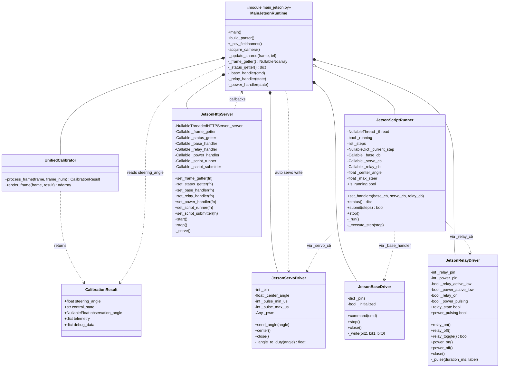
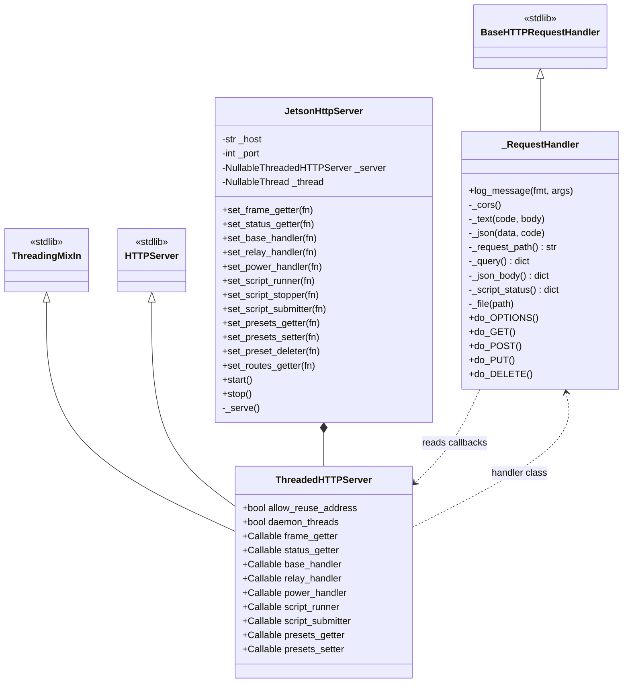

# Calibration Call Map

Tai lieu nay map cac function chinh cua flow Jetson calibration hien tai:

- camera -> core calibration -> overlay/dashboard stream
- core calibration -> servo PWM
- dashboard route script -> GPIO base/servo/relay
- HTTP dashboard -> runtime handlers

Branch doc duoc viet tu code hien tai tren `jetson-nano-direct`.

UML PlantUML source:

- [`docs/calibration_class_diagram.puml`](calibration_class_diagram.puml)

## 0. Diagrams

### 0.1 Core Calibration Classes

```mermaid
classDiagram
    class UnifiedCalibrator {
        -ConfigManager _config
        -RobotState _robot_state
        -VisionProcessor _vision
        -GeometryCalculator _geometry
        -SteeringController _steering
        -NullableTelemetryLogger _telemetry
        -OverlayDrawer _overlay_drawer
        +process_frame(frame, frame_num) CalibrationResult
        +render_frame(frame, result) ndarray
        +update(frame, frame_num) float
        +run()
        +close()
    }

    class ConfigManager {
        -dict _system_configs
        -dict _debug_configs
        -dict _video_configs
        -dict _stream_configs
        -float _vp_inner_thresh
        -float _vp_outer_thresh
        -int _danger_margin_px
        -float _danger_nudge_deg
        +get_system_configs() dict
        +get_debug_configs() dict
        +get_video_configs() dict
        +get_stream_configs() dict
        +get_vp_thresholds() tuple
        +get_danger_margins() tuple
    }

    class VisionProcessor {
        -float _roi_height_pct
        -int _canny_low
        -int _canny_high
        -int _hough_threshold
        -float _min_abs_slope
        +process_frame(frame) list
        +process_frame_debug(frame) tuple
        +_apply_geometric_filter(lines) NullableTuple
    }

    class GeometryCalculator {
        +describe_line(line, role, bottom_intercept) dict
        +classify_point(point, frame_width, frame_height) str
        +calculate_vanishing_point(line1, line2) NullableTuple
        +calculate_bottom_intercepts(line1, line2, frame_height) tuple
        +map_vp_to_angle(vp_x, frame_width) float
    }

    class SteeringController {
        -PIDConstants _pid
        -int _danger_margin
        -float _nudge_deg
        -float _inner_thresh
        -float _outer_thresh
        -float _center
        -float _max_offset
        -bool _tracking_active
        -float _last_error
        +compute_steering(vp_angle, left_intercept, right_intercept, frame_width) tuple
        +describe_control_state(state, frame_width) dict
        +get_params() dict
        +update_params(patch) dict
        -_apply_pd(error) float
    }

    class RobotState {
        +PIDConstants pid
        +float servo_center_angle
        +float max_steering_offset
        +float last_valid_servo_angle
        +FSMState fsm_state
        +bool calibration_active
        +float pid_integral
        +float pid_last_error
        +transition_to(new_state)
        +reset_pid_integral()
    }

    class PIDConstants {
        +float kp
        +float ki
        +float kd
    }

    class CalibrationResult {
        +float steering_angle
        +str control_state
        +NullableFloat observation_angle
        +bool calibration_active
        +dict telemetry
        +dict debug_data
    }

    class TelemetryLogger {
        -OverlayDrawer _overlay_drawer
        -Any _csv_writer
        -Any _video_writer
        -Any _frame_store
        +log_state(frame_num, telemetry_data)
        +update_visuals(frame, telemetry_data, debug_data) ndarray
        +publish_stream(frame, telemetry_data)
        +write_video(frame)
        +close()
        +sleep_remainder(loop_start, loop_period)
    }

    class OverlayDrawer {
        +float inner_thresh
        +float outer_thresh
        +int danger_margin_px
        +float angle_center
        +float angle_span
        +draw(frame, debug_packet) ndarray
    }

    UnifiedCalibrator *-- ConfigManager
    UnifiedCalibrator *-- RobotState
    UnifiedCalibrator *-- VisionProcessor
    UnifiedCalibrator *-- GeometryCalculator
    UnifiedCalibrator *-- SteeringController
    UnifiedCalibrator o-- TelemetryLogger
    UnifiedCalibrator *-- OverlayDrawer
    UnifiedCalibrator ..> CalibrationResult : returns
    RobotState *-- PIDConstants
    SteeringController o-- PIDConstants
    TelemetryLogger *-- OverlayDrawer
```



### 0.2 Jetson Runtime, Drivers, And Dashboard



### 0.3 HTTP Request Handler Classes



## 1. High-Level Runtime Flow

```text
main_jetson.main()
  -> acquire_camera()
  -> loop cap.read()
  -> UnifiedCalibrator.process_frame(frame, frame_num)
       -> VisionProcessor.process_frame_debug(frame)
       -> VisionProcessor._apply_geometric_filter(lines)
       -> GeometryCalculator.calculate_bottom_intercepts(line1, line2, frame_h)
       -> GeometryCalculator.describe_line(...)
       -> GeometryCalculator.calculate_vanishing_point(line1, line2)
       -> GeometryCalculator.map_vp_to_angle(vp_x, frame_w)
       -> SteeringController.compute_steering(vp_angle, left_intercept, right_intercept, frame_w)
       -> SteeringController.describe_control_state(fsm_state, frame_w)
       -> RobotState.transition_to(FSMState(fsm_state))
       -> CalibrationResult(...)
  -> UnifiedCalibrator.render_frame(frame, calibration)
       -> OverlayDrawer.draw(frame, debug_packet)
  -> JetsonServoDriver.send_angle(calibration.steering_angle)
  -> _update_shared(display_frame, telemetry)
       -> JetsonHttpServer /stream and /api/status
  -> CSV write
```

Main output cua algorithm la `CalibrationResult`:

- `steering_angle`: goc servo da tinh xong, dua xuong `JetsonServoDriver.send_angle()`.
- `control_state`: FSM hien tai, vi du `GAPPING`, `TRACKING_PD`, `DANGER_LEFT`.
- `observation_angle`: goc VP/theta raw neu co.
- `calibration_active`: true khi dang tracking PD.
- `telemetry`: dict de dashboard/CSV/overlay dung.
- `debug_data`: vision intermediates de overlay/debug panel dung.

## 2. Entrypoint And Wrappers

| Function | File | Goi toi | Vai tro |
|---|---|---|---|
| [`main()`](../main_jetson.py#L219) | `main_jetson.py` | `UnifiedCalibrator`, Jetson drivers, HTTP server | Entrypoint Jetson direct. Tao core, GPIO drivers, dashboard server, camera loop. |
| [`build_parser()`](../main_jetson.py#L57) | `main_jetson.py` | env/config defaults | Parse CLI: camera, hz, csv, flip, dashboard host/port, servo pin. |
| [`_csv_fieldnames()`](../main_jetson.py#L70) | `main_jetson.py` | CSV writer | Dinh nghia columns log Jetson runtime. |
| [`acquire_camera()`](../main_jetson.py#L348) | `main_jetson.py` | `cv2.VideoCapture` | Auto-detect camera index, retry mai den khi co camera. |
| [`_update_shared()`](../main_jetson.py#L261) | `main_jetson.py` | shared state | Copy frame da overlay + telemetry cho HTTP server doc. |
| [`_frame_getter()`](../main_jetson.py#L267) | `main_jetson.py` | `JetsonHttpServer` | Cap frame cho `/stream`. |
| [`_status_getter()`](../main_jetson.py#L271) | `main_jetson.py` | `JetsonHttpServer` | Build JSON cho `/api/status`, dashboard poll lien tuc. |
| [`_base_handler()`](../main_jetson.py#L297) | `main_jetson.py` | `JetsonBaseDriver.command()` | Dashboard/script -> GPIO base command. |
| [`_relay_handler()`](../main_jetson.py#L302) | `main_jetson.py` | `JetsonRelayDriver.relay_on/off()` | Dashboard relay toggle. |
| [`_power_handler()`](../main_jetson.py#L308) | `main_jetson.py` | `JetsonRelayDriver.power_on/off()` | Dashboard power pulse. |

## 3. Core Calibration Classes

### 3.1 Config And Result Types

| Function/Class | File | Goi toi | Vai tro |
|---|---|---|---|
| [`ConfigManager.__init__()`](../unified_calibration_components.py#L88) | `unified_calibration_components.py` | `config.settings._get_*` | Load env/config cho loop, debug, video, stream, VP thresholds, danger margin. |
| [`ConfigManager.get_vp_thresholds()`](../unified_calibration_components.py#L155) | `unified_calibration_components.py` | caller | Tra ve hysteresis `inner`, `outer`. |
| [`ConfigManager.get_danger_margins()`](../unified_calibration_components.py#L159) | `unified_calibration_components.py` | caller | Tra ve danger margin px + nudge deg. |
| [`CalibrationResult`](../unified_calibration_components.py#L29) | `unified_calibration_components.py` | returned by core | Dataclass output cua mot frame calibration. |
| [`CalibrationProcessingError`](../unified_calibration_components.py#L61) | `unified_calibration_components.py` | wrappers catch | Loi co stage/process ro rang de debug. |

### 3.2 Vision Stage

| Function | File | Goi toi | Output |
|---|---|---|---|
| [`VisionProcessor.__init__()`](../unified_calibration_components.py#L167) | `unified_calibration_components.py` | `config.settings._get_*` | Load ROI, blur, Canny, Hough, min slope. |
| [`VisionProcessor.process_frame()`](../unified_calibration_components.py#L178) | `unified_calibration_components.py` | `process_frame_debug()` | Convenience: chi tra `lines`. |
| [`VisionProcessor.process_frame_debug()`](../unified_calibration_components.py#L183) | `unified_calibration_components.py` | `cv2.cvtColor`, `cv2.GaussianBlur`, `cv2.Canny`, `cv2.HoughLinesP` | Tra `(lines, vision_debug)`. Lines la list `(x1,y1,x2,y2)`. |
| [`VisionProcessor._apply_geometric_filter()`](../unified_calibration_components.py#L243) | `unified_calibration_components.py` | `math.hypot` | Chon line negative slope dai nhat + positive slope dai nhat. Neu thieu 1 ben -> `None`. |

Vision data flow:

```text
frame
  -> ROI top slice
  -> grayscale
  -> blur
  -> Canny edges
  -> HoughLinesP
  -> raw lines
  -> _apply_geometric_filter()
  -> selected left/negative + right/positive line pair
```

### 3.3 Geometry Stage

| Function | File | Goi toi | Output |
|---|---|---|---|
| [`GeometryCalculator.describe_line()`](../unified_calibration_components.py#L283) | `unified_calibration_components.py` | `hypot` | Diagnostic: endpoints, slope, length, bottom intercept. |
| [`GeometryCalculator.classify_point()`](../unified_calibration_components.py#L303) | `unified_calibration_components.py` | none | Phan loai VP: `inside`, `missing`, `above_left`, `below_right`, etc. |
| [`GeometryCalculator.calculate_vanishing_point()`](../unified_calibration_components.py#L319) | `unified_calibration_components.py` | line intersection math | Giao diem 2 line. Parallel -> `None`. |
| [`GeometryCalculator.calculate_bottom_intercepts()`](../unified_calibration_components.py#L339) | `unified_calibration_components.py` | inner `x_at_y()` | X tai day frame cho 2 line. Sau do core sort thanh `left_intercept`, `right_intercept`. |
| [`GeometryCalculator.map_vp_to_angle()`](../unified_calibration_components.py#L360) | `unified_calibration_components.py` | none | Map `vp_x` sang theta proxy: `180 / frame_width * vp_x`. Center frame ~= 90 deg. |

Geometry data flow:

```text
selected line pair
  -> calculate_bottom_intercepts()
       -> left_intercept/right_intercept
  -> calculate_vanishing_point()
       -> vp=(x,y)
  -> map_vp_to_angle(vp_x, frame_w)
       -> vp_angle/theta
```

### 3.4 Steering Stage

| Function | File | Goi toi | Output |
|---|---|---|---|
| [`SteeringController.__init__()`](../control/steering_controller.py#L26) | `control/steering_controller.py` | `PIDConstants` | Load PID, danger margin, nudge, hysteresis, center, max offset. |
| [`SteeringController.compute_steering()`](../control/steering_controller.py#L46) | `control/steering_controller.py` | `_apply_pd()` | Tra `(steering_angle, fsm_state)`. Day la law chinh cua servo. |
| [`SteeringController.describe_control_state()`](../control/steering_controller.py#L101) | `control/steering_controller.py` | none | Map FSM sang danger boundary/recovery text cho telemetry/overlay. |
| [`SteeringController._apply_pd()`](../control/steering_controller.py#L127) | `control/steering_controller.py` | PID state | `kp * error + kd * derivative`, update `_last_error`. |
| [`SteeringController.get_params()`](../control/steering_controller.py#L147) | `control/steering_controller.py` | dashboard tuning API | Read live params. |
| [`SteeringController.update_params()`](../control/steering_controller.py#L159) | `control/steering_controller.py` | dashboard tuning API | Clamp + update live params. |

Steering FSM:

```text
No VP/intercepts
  -> GAPPING
  -> servo = center

left_intercept > danger_margin
  -> DANGER_RIGHT
  -> servo = center + nudge_deg

right_intercept < frame_width - danger_margin
  -> DANGER_LEFT
  -> servo = center - nudge_deg

both danger
  -> AMBIGUOUS_DANGER
  -> servo = center

abs(vp_angle - 90) <= inner_thresh
  -> TRACKING_COAST
  -> servo = center

abs(vp_angle - 90) > outer_thresh
  -> TRACKING_PD
  -> servo = clamp(center + PD(error), center +/- max_offset)
```

### 3.5 Unified Frame Function

[`UnifiedCalibrator.process_frame()`](../unified_calibration_components.py#L740) la ham trung tam.

Call chain chi tiet:

```text
UnifiedCalibrator.process_frame(frame, frame_num)
  -> validate frame
  -> VisionProcessor.process_frame_debug(frame)
  -> VisionProcessor._apply_geometric_filter(lines)
  -> if selected:
       -> draw selected lines into vision_debug["grouped_vis"]
       -> GeometryCalculator.calculate_bottom_intercepts(line1, line2, frame_h)
       -> sort intercepts
       -> GeometryCalculator.describe_line(selected_left_line, ...)
       -> GeometryCalculator.describe_line(selected_right_line, ...)
       -> GeometryCalculator.calculate_vanishing_point(line1, line2)
       -> if vp:
            -> GeometryCalculator.map_vp_to_angle(vp[0], frame_w)
  -> SteeringController.compute_steering(...)
  -> SteeringController.describe_control_state(...)
  -> RobotState.transition_to(FSMState(fsm_state))
  -> assemble telemetry_data
  -> assemble debug_data
  -> return CalibrationResult(...)
```

Side effects trong `process_frame()`:

- Update `RobotState.fsm_state`.
- Update `RobotState.calibration_active`.
- Update `RobotState.last_valid_servo_angle`.
- Update `RobotState.pid_last_error`.

Khong co hardware IO trong function nay. No chi tinh result.

## 4. Overlay, Telemetry, Stream

| Function | File | Goi toi | Vai tro |
|---|---|---|---|
| [`UnifiedCalibrator.render_frame()`](../unified_calibration_components.py#L953) | `unified_calibration_components.py` | `OverlayDrawer.draw()` | Render Nam-core overlay cho Jetson wrapper. |
| [`TelemetryLogger.update_visuals()`](../unified_calibration_components.py#L551) | `unified_calibration_components.py` | `OverlayDrawer.draw()`, optional debug panel | Render overlay + optional vision debug panel cho runtime co telemetry logger. |
| [`TelemetryLogger.publish_stream()`](../unified_calibration_components.py#L641) | `unified_calibration_components.py` | `SharedFrameStore.set_frame()` | Push frame vao HTTPS stream bridge neu enabled. |
| [`TelemetryLogger.log_state()`](../unified_calibration_components.py#L541) | `unified_calibration_components.py` | CSV writer | Ghi telemetry row. |
| [`TelemetryLogger.write_video()`](../unified_calibration_components.py#L649) | `unified_calibration_components.py` | video writer | Ghi debug MP4 neu enabled. |
| [`OverlayDrawer.draw()`](../runtime/overlay_drawer.py#L47) | `runtime/overlay_drawer.py` | `_draw_floor_visuals()`, `_draw_telemetry_panel()`, `_draw_hysteresis_gauge()` | Ve line, VP, intercept, HUD, gauge len frame. |

Jetson stream path:

```text
main_jetson loop
  -> calibration = UnifiedCalibrator.process_frame(...)
  -> display_frame = UnifiedCalibrator.render_frame(frame, calibration)
  -> _update_shared(display_frame, tel)
  -> JetsonHttpServer._frame_getter()
  -> runtime/jetson_http.py /stream
  -> MJPEG browser dashboard
```

## 5. Actuator Path: Servo, Base, Relay

### 5.1 Auto Calibration Servo Path

```text
UnifiedCalibrator.process_frame()
  -> CalibrationResult.steering_angle
  -> main_jetson.main()
  -> if route script is not running:
       JetsonServoDriver.send_angle(steering_angle)
  -> GPIO PWM pin 33 default
```

| Function | File | Goi toi | Vai tro |
|---|---|---|---|
| [`JetsonServoDriver.__init__()`](../drivers/jetson_servo.py#L40) | `drivers/jetson_servo.py` | `Jetson.GPIO.PWM` | Setup BOARD pin, PWM 50Hz, start center. |
| [`JetsonServoDriver.send_angle()`](../drivers/jetson_servo.py#L77) | `drivers/jetson_servo.py` | `_angle_to_duty()` + `PWM.ChangeDutyCycle()` | Clamp goc va ghi duty PWM. |
| [`JetsonServoDriver._angle_to_duty()`](../drivers/jetson_servo.py#L99) | `drivers/jetson_servo.py` | env min/max pulse | Map angle -> pulse width -> duty percent. |
| [`JetsonServoDriver.center()`](../drivers/jetson_servo.py#L85) | `drivers/jetson_servo.py` | `send_angle(center)` | Ve center angle. |

### 5.2 Route Script GPIO Path

Dashboard route builder khong di qua algorithm. No goi HTTP -> script runner -> GPIO:

```text
dashboard script.js
  -> POST /route/script or /route/script/step
  -> runtime/jetson_http.py do_POST()
  -> JetsonHttpServer.script_submitter
  -> JetsonScriptRunner.submit()
  -> JetsonScriptRunner._run()
  -> JetsonScriptRunner._execute_step()
       -> _base_handler(base_cmd)
            -> JetsonBaseDriver.command(cmd)
            -> JetsonBaseDriver._write(bit2, bit1, bit0)
       -> JetsonServoDriver.send_angle(script_angle) if action needs steering
```

| Function | File | Goi toi | Vai tro |
|---|---|---|---|
| [`JetsonScriptRunner.submit()`](../main_jetson.py#L135) | `main_jetson.py` | `_run()` thread | Accept route steps va start thread. |
| [`JetsonScriptRunner._run()`](../main_jetson.py#L150) | `main_jetson.py` | `_execute_step()` | Chay tung step, finally STOP base + center servo. |
| [`JetsonScriptRunner._execute_step()`](../main_jetson.py#L178) | `main_jetson.py` | `_base_cb`, `_servo_cb` | Map action sang base command + servo script angle. |
| [`JetsonBaseDriver.command()`](../drivers/jetson_base.py#L84) | `drivers/jetson_base.py` | `_write()` | Map command sang 3-bit GPIO. |
| [`JetsonBaseDriver._write()`](../drivers/jetson_base.py#L108) | `drivers/jetson_base.py` | `GPIO.output()` | Ghi OUT1/OUT2/OUT3. |
| [`JetsonRelayDriver.relay_on()`](../drivers/jetson_relay.py#L71) | `drivers/jetson_relay.py` | `_set_relay(True)` | Bat relay. |
| [`JetsonRelayDriver.relay_off()`](../drivers/jetson_relay.py#L77) | `drivers/jetson_relay.py` | `_set_relay(False)` | Tat relay. |
| [`JetsonRelayDriver.power_on()`](../drivers/jetson_relay.py#L90) | `drivers/jetson_relay.py` | `_pulse(power_on_ms, "ON")` | Power pulse ngan. |
| [`JetsonRelayDriver.power_off()`](../drivers/jetson_relay.py#L94) | `drivers/jetson_relay.py` | `_pulse(power_off_ms, "OFF")` | Power pulse dai. |

Base bit table hien tai:

| Command | OUT1 / pin 15 | OUT2 / pin 13 | OUT3 / pin 11 |
|---|---:|---:|---:|
| `STOP` | 0 | 0 | 0 |
| `FORWARD` | 0 | 1 | 0 |
| `BACKWARD` | 0 | 0 | 1 |
| `LOCK` | 1 | 0 | 1 |
| `UNLOCK` | 1 | 1 | 0 |
| `TURN_LEFT` | 1 | 0 | 0 |
| `TURN_RIGHT` | 0 | 1 | 1 |

Script action table:

| Action | Base command | Servo behavior |
|---|---|---|
| `forward` | `FORWARD` | center angle |
| `straight` | `FORWARD` | center angle |
| `backward` | `BACKWARD` | center angle |
| `left` | `FORWARD` | center + max steer, republished during step |
| `right` | `FORWARD` | center - max steer, republished during step |
| `turn_left` | `TURN_LEFT` | no servo override |
| `turn_right` | `TURN_RIGHT` | no servo override |
| `stop` / `pause` | `STOP` | center angle |

While route script is running, auto PID servo write is paused in [`main_jetson.py`](../main_jetson.py#L424). This prevents the vision loop from stealing the route-script steering target.

## 6. HTTP Dashboard Function Map

| HTTP route | Handler | Calls | Purpose |
|---|---|---|---|
| `GET /` | [`_RequestHandler.do_GET()`](../runtime/jetson_http.py#L99) | `_file(index.html)` | Dashboard HTML. |
| `GET /dashboard/static/*` | [`do_GET()`](../runtime/jetson_http.py#L99) | `_file()` | CSS/JS static files. |
| `GET /stream` | [`do_GET()`](../runtime/jetson_http.py#L99) | `server.frame_getter()` | MJPEG stream from shared overlay frame. |
| `GET /api/status` | [`do_GET()`](../runtime/jetson_http.py#L99) | `server.status_getter()` | Dashboard live telemetry. |
| `POST /route/script` | [`do_POST()`](../runtime/jetson_http.py#L196) | `script_submitter()` | Run full route script. |
| `POST /route/script/step` | [`do_POST()`](../runtime/jetson_http.py#L196) | `script_submitter()` | Run one step. |
| `POST /route/script/stop` | [`do_POST()`](../runtime/jetson_http.py#L196) | `script_stopper()` | Stop running route script. |
| `GET /route/script/status` | [`do_GET()`](../runtime/jetson_http.py#L99) | `_script_status()` | Poll script state/progress. |
| `POST /route/relay` | [`do_POST()`](../runtime/jetson_http.py#L196) | `relay_handler()` | Relay on/off. |
| `POST /control/power` | [`do_POST()`](../runtime/jetson_http.py#L196) | `power_handler()` | Power pulse on/off. |
| `GET /presets` | [`do_GET()`](../runtime/jetson_http.py#L99) | `presets_getter()` | List route presets. |
| `GET /presets/{name}` | [`do_GET()`](../runtime/jetson_http.py#L99) | `presets_getter()` | Load route preset. |
| `PUT /presets/{name}` | [`do_PUT()`](../runtime/jetson_http.py#L238) | `presets_setter()` | Save route preset. |
| `DELETE /presets/{name}` | [`do_DELETE()`](../runtime/jetson_http.py#L251) | `preset_deleter()` | Delete route preset. |

## 7. State Model

| Class/Function | File | Used by | Purpose |
|---|---|---|---|
| [`FSMState`](../models/robot_state.py#L21) | `models/robot_state.py` | `UnifiedCalibrator`, dashboard, CSV | Enum cac state steering. |
| [`PIDConstants`](../models/robot_state.py#L33) | `models/robot_state.py` | `SteeringController` | PID gains from env. |
| [`RobotState`](../models/robot_state.py#L42) | `models/robot_state.py` | `UnifiedCalibrator` | Runtime state + servo center/max offset + PID memory. |
| [`RobotState.transition_to()`](../models/robot_state.py#L59) | `models/robot_state.py` | `UnifiedCalibrator.process_frame()` | Set FSM current state. |
| [`RobotState.reset_pid_integral()`](../models/robot_state.py#L63) | `models/robot_state.py` | optional callers | Reset integral memory. |

## 8. Important Boundaries

### Algorithm boundary

`UnifiedCalibrator.process_frame()` is pure-ish compute path:

- input: `frame`, `frame_num`
- output: `CalibrationResult`
- no GPIO, no servo PWM, no HTTP, no dashboard write

### Wrapper boundary

`main_jetson.main()` owns:

- camera lifecycle
- GPIO driver lifecycle
- dashboard server lifecycle
- CSV file
- calling servo/base/relay hardware

### Dashboard route boundary

`JetsonScriptRunner` does not run image calibration. It only executes manual route steps:

- `forward`, `left`, `right`, `turn_left`, etc.
- direct GPIO base/servo commands
- stops base and centers servo at end

## 9. One-Line Debug Checklist

If servo auto-calib wrong:

```text
UnifiedCalibrator.process_frame()
  -> CalibrationResult.steering_angle
  -> main_jetson.py servo.send_angle()
  -> JetsonServoDriver._angle_to_duty()
```

If route dashboard base GPIO wrong:

```text
POST /route/script/step
  -> JetsonScriptRunner._execute_step()
  -> _base_handler()
  -> JetsonBaseDriver.command()
  -> _BASE_MAP
  -> GPIO.output(pin15,pin13,pin11)
```

If stream overlay wrong:

```text
calibrator.render_frame()
  -> OverlayDrawer.draw()
  -> _update_shared(display_frame, tel)
  -> GET /stream
```
